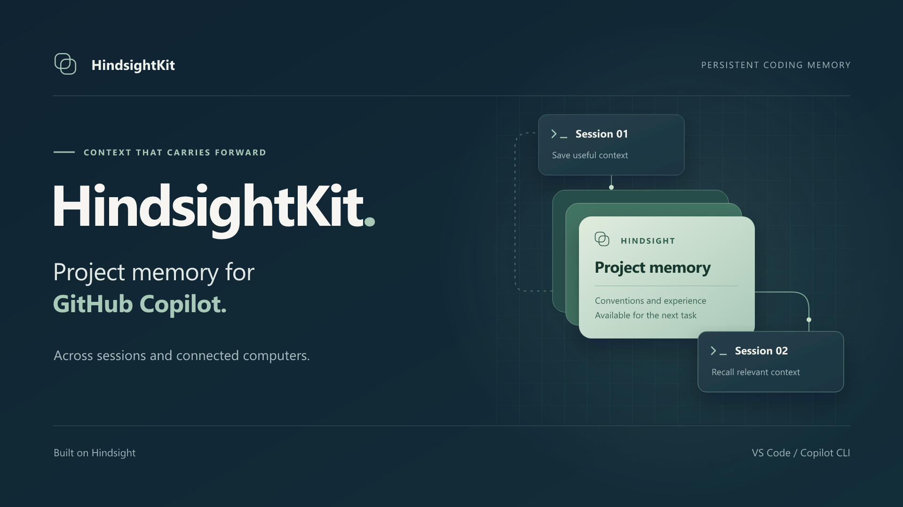

# HindsightKit

## 中文

### 一句话介绍

HindsightKit 为 GitHub Copilot 接入持久记忆，让项目经验可以跨会话复用，并在连接同一服务的电脑间共享。

### Description

HindsightKit 将官方 Hindsight 记忆服务接入 GitHub Copilot Chat 和 CLI，让项目约定和已保存的经验在后续编码会话中继续可用。它负责服务安装与集成，按 Git 仓库选择记忆范围，并支持多台电脑连接同一个记忆服务。开发者可以在 VS Code 或终端中调用记忆，减少重复交代背景。可选的 WorkIQ 连接器还能从邮件讨论中提取当前结论，保留来源链接，供后续任务检索。

## English

### One-line introduction

HindsightKit gives GitHub Copilot persistent project memory across coding sessions and computers connected to the same memory server.

### Description

HindsightKit connects GitHub Copilot Chat and CLI to the official Hindsight memory service, so project conventions and saved experience remain available in later coding sessions. It handles installation and integration, selects memory by Git repository, and lets multiple computers use the same memory server. Developers can recall context from VS Code or the terminal and spend less time repeating background information. An optional WorkIQ connector also extracts current outcomes from email discussions, preserving source links for later retrieval.

## Cover

[cover.png](cover.png) is a 1920 × 1080 cover for presentations and demo videos. [cover.svg](cover.svg) is the editable source.

